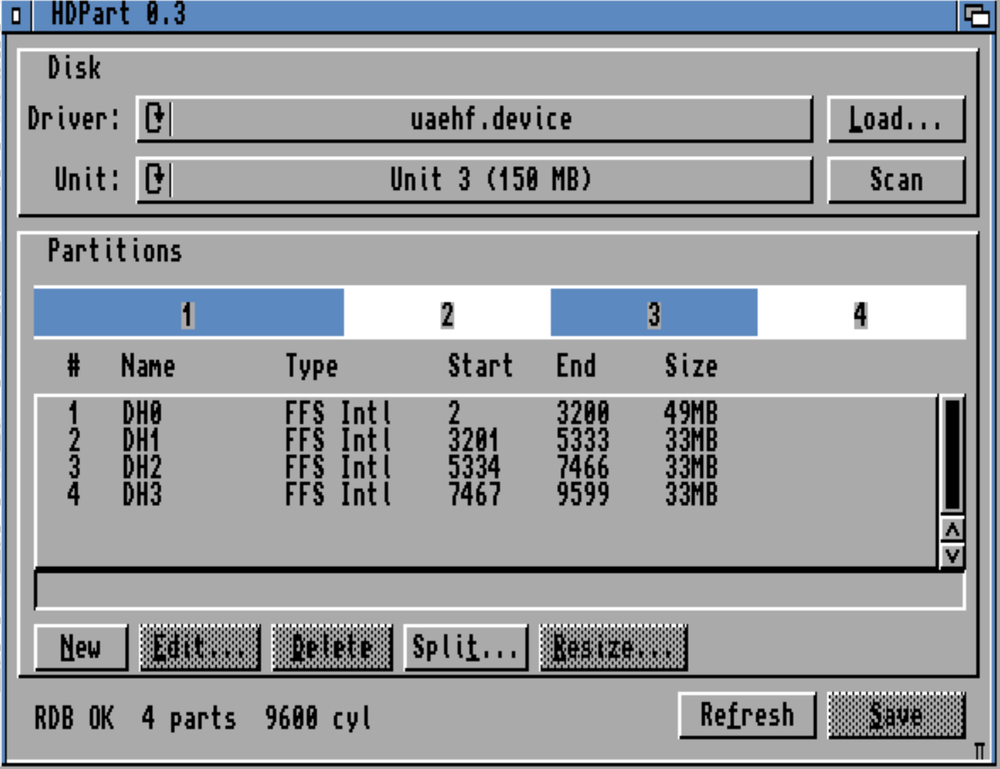

# HDPart

A modern AmigaOS **RDB hard-disk partition tool** for Kickstart 2.04+ (V37+) — a
usable HDToolBox replacement aimed at CF/SD-on-IDE retro setups. GadTools GUI,
single window, runs on a real Workbench or boots standalone from its own floppy.

- Discover a device → read its Rigid Disk Block → init / partition / resize / split → save.
- Two-panel GUI (Disk / Partitions) with a disk-map bar, a screen-top Amiga menu
  bar, and keyboard shortcuts.
- Freestanding 68000 build (no libc) — runs on a stock A500+/A600/A1200/A4000.



## Credits & attribution

HDPart's RDB handling is **based on `rdbtool`** (part of **amitools**) by
**Christian Vogelgsang, © 2020–2023**. The engine's on-disk RDB layout follows
rdbtool, and the host test suite cross-checks HDPart's output **byte-for-byte
against `rdbtool`** (`tests/verify-rdbtool.sh`). With thanks.

- Docs: https://amitools.readthedocs.io/en/latest/tools/rdbtool.html
- Source: https://github.com/cnvogelg/amitools

Built entirely with **Bartman's `vscode-amiga-debug`** C/C++ toolchain &
extension (m68k-amiga-elf GCC, `elf2hunk`, and the Amiga SDK) — thank you.

- Source: https://github.com/BartmanAbyss/vscode-amiga-debug

## Building

Uses the Bartman `amiga-debug` GCC cross-toolchain (m68k-amiga-elf, gcc 15.x),
which is **not** on the default PATH:

```sh
export AMIGA_BIN="$HOME/.vscode/extensions/bartmanabyss.amiga-debug-1.8.2/bin/darwin"  # or .../linux
export PATH="$AMIGA_BIN/opt/bin:$AMIGA_BIN:$PATH"

make            # -> out/HDPart.exe (AmigaDOS hunk) + out/HDPart.elf (symbols)
make adf        # -> out/HDPart-<ver>.adf  (bootable 880K OFS floppy; needs amitools' xdftool)
```

Host-side RDB engine tests (system `cc`, no toolchain needed):

```sh
./tests/run-host-tests.sh       # unit tests for the RDB engine
./tests/verify-rdbtool.sh       # byte-for-byte cross-check vs amitools rdbtool
```

## Releases

Pushing a `release-x.x` git tag triggers a GitHub Actions build that publishes a
release with the versioned ADF and executable. The tag version must match the
`ADFVER` in the `Makefile` (and the window title in `src/gui.c`).

## License

HDPart's own source is released under the **MIT License** — see [`LICENSE`](LICENSE).

amitools / rdbtool are © Christian Vogelgsang and the Bartman toolchain is © its
authors, each under their own license; **HDPart bundles no amitools, Bartman,
Commodore, or Amiga files** (the toolchain, Kickstart ROM, and Workbench fonts are
all external to this repo).
